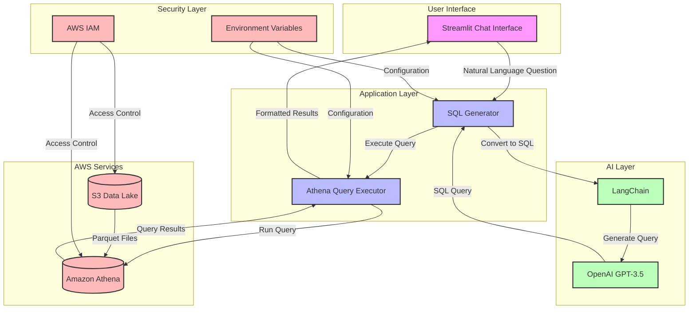

# GenAI-Powered Analytics Assistant

Author: Dilliraja Sundar

A chatbot web application that allows users to ask natural language questions about data stored in Amazon S3 and query it using Amazon Athena. The application uses LangChain and OpenAI to convert natural language questions into SQL queries.

## Quick Start Guide (5 Minutes)

1. Create an S3 bucket for your data:
   ```bash
   aws s3 mb s3://your-bucket-name
   ```

2. Create an Athena database:
   ```sql
   CREATE DATABASE your_database_name;
   ```

3. Create the sales_data table in Athena:
   ```sql
   CREATE EXTERNAL TABLE IF NOT EXISTS sales_data (
       customer_id STRING,
       order_date DATE,
       amount DECIMAL(10,2),
       region STRING
   )
   STORED AS PARQUET
   LOCATION 's3://your-bucket-name/sales_data/';
   ```

4. Create an S3 bucket for Athena query results:
   ```bash
   aws s3 mb s3://your-bucket-name/athena-results
   ```

5. Set up IAM permissions:
   - Create an IAM user with the following permissions:
     - AmazonAthenaFullAccess
     - AmazonS3ReadOnlyAccess
   - Generate access keys for the user

## Features

- Natural language to SQL conversion using LangChain and OpenAI
- Integration with Amazon Athena for query execution
- Clean and intuitive Streamlit-based chat interface
- Support for Parquet data stored in S3
- Comprehensive error handling and logging
- Cost-effective, serverless design

## Architecture



### Component Description

1. **User Interface**
   - Streamlit-based chat interface
   - Handles user input and displays results
   - Manages chat history and session state

2. **Application Layer**
   - SQL Generator: Converts natural language to SQL
   - Athena Query Executor: Manages query execution and results

3. **AI Layer**
   - OpenAI GPT-3.5: Powers natural language understanding
   - LangChain: Manages prompt templates and query generation

4. **AWS Services**
   - S3 Data Lake: Stores Parquet files
   - Amazon Athena: Executes SQL queries

5. **Security Layer**
   - AWS IAM: Manages access control
   - Environment Variables: Stores sensitive configuration

### Data Flow

1. User submits a natural language question
2. SQL Generator uses LangChain and OpenAI to convert it to SQL
3. Athena Query Executor runs the SQL query
4. Results are formatted and returned to the user
5. All components are secured through AWS IAM and environment variables

## Prerequisites

- Python 3.8+
- AWS Account with appropriate permissions
- OpenAI API key
- Amazon Athena and S3 setup

## Local Setup

1. Clone the repository:
   ```bash
   git clone <repository-url>
   cd genai-analytics-assistant
   ```

2. Create a virtual environment:
   ```bash
   python -m venv venv
   source venv/bin/activate  # On Windows: venv\Scripts\activate
   ```

3. Install dependencies:
   ```bash
   pip install -r requirements.txt
   ```

4. Create a `.env` file with your configuration:
   ```
   AWS_REGION=us-east-1
   S3_BUCKET=your-bucket-name
   ATHENA_DATABASE=your_database_name
   ATHENA_WORKGROUP=primary
   ATHENA_OUTPUT_LOCATION=s3://your-bucket-name/athena-results/
   OPENAI_API_KEY=your-openai-api-key
   ```

5. Run the application:
   ```bash
   streamlit run streamlit_ui.py
   ```

## Example Questions

Here are some example questions you can ask the chatbot:

1. "What is the total sales amount by region?"
2. "Show me the top 5 customers by total spending"
3. "What was the average order amount in the last 30 days?"
4. "Which region had the highest sales in January 2024?"
5. "How many orders were placed per day last week?"

## Error Handling

The application includes comprehensive error handling for:
- Invalid SQL queries
- Athena query execution failures
- Missing or invalid configuration
- API rate limiting
- Network connectivity issues

## Logging

Logs are written to both the console and a log file with the following information:
- SQL query generation
- Query execution status
- Error messages
- Application state changes

## Security Considerations

### Data Privacy
1. **OpenAI API Usage**
   - All queries are sent to OpenAI's servers
   - Data might be used for model training unless explicitly opted out
   - Consider using OpenAI's data opt-out option for sensitive data
   - Review OpenAI's data usage policies and terms of service

2. **Query Security**
   - SQL queries are sanitized and validated before execution
   - Only read-only operations are allowed (SELECT queries only)
   - Dangerous SQL patterns are blocked
   - Input validation is performed on all user queries

3. **AWS Security**
   - Use IAM roles with minimum required permissions
   - Enable AWS CloudTrail for audit logging
   - Use AWS KMS for encryption at rest
   - Implement proper S3 bucket policies
   - Use VPC endpoints for AWS services

4. **Best Practices**
   - Regularly rotate API keys and credentials
   - Monitor API usage and costs
   - Implement rate limiting
   - Use environment variables for sensitive configuration
   - Regular security audits and updates

### Security Recommendations
1. **Data Minimization**
   - Only send necessary data to OpenAI
   - Use data masking for sensitive fields
   - Implement row-level security in Athena
   - Consider using data sampling for large datasets

2. **Access Control**
   - Implement user authentication
   - Use AWS IAM roles with least privilege
   - Enable MFA for AWS accounts
   - Regular access review and cleanup

3. **Monitoring**
   - Set up CloudWatch alarms
   - Monitor API usage patterns
   - Log all queries and responses
   - Regular security scanning

4. **Compliance**
   - Review data residency requirements
   - Ensure GDPR compliance if applicable
   - Document data processing activities
   - Regular compliance audits 